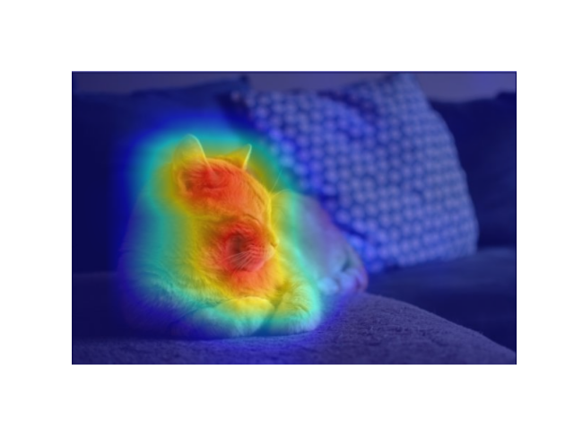

# Amazing Visualization
[](https://www.murphysec.com/p/Berry-Wu/Visualization)
> 本项目实现一些有意思且有用的可视化，部分代码有所参考，且均在代码中标注出

## 0、更新日志
- 10.18日新增人体关键点热图可视化
- 10.23日新增guided-backpropagation可视化

## 1、卷积核可视化：
> 参考链接：https://debuggercafe.com/visualizing-filters-and-feature-maps-in-convolutional-neural-networks-using-pytorch/
> 
> 使用resnet50预训练模型

  **使用方法：**
> 1. 导入预训练模型
> 2. 输入一张图片经过网络
> 3. 调用visual.py中的卷积核可视化及特征图可视化

  **效果示例：**
  - filter3(这里指第三个卷积结构的卷积核)
  
  
  - filter48
  
  
  
## 2、特征图可视化：
  - layer0

  
  - layer4

  
  
## 3、注意力可视化(8.27新增)
  
> 见visual.py 中 vis_grid_attention函数

  **效果展示：**  
  - 原图:
  
  
  - 注意力可视化后:
  
  
  - 注:这里的attention_map并非来自真实得到,是定义的一个二维数组
  ```python
    attention_map = np.zeros((20, 20))
    attention_map[9][9] = 1
    attention_map[10][12] = 1
  ```
## 4、注意力矩阵热图:
> 见visual.py下vis_attention_matrix函数
> 
> 这里使用的是随机产生正态分布的二维矩阵
  
  
  
## 5、img_patch以及patch_mask实现及可视化(8.31新增)
> 新增img_patch.py,且得到的结果支持输入encoder

> 参考MAE官方实现，论文也很好看arXiv:2111.06377
  
  **将图像划分为patch块：**
  
  
  
  **随机mask，mask_ratio=0.75:**
  
  
  
## 6、Grad-CAM热力图(9.4新增)
> 新增grad-cam文件夹

> Grad-CAM的论文简单易懂，且实验效果挺有意思的，建议一看arXiv:1610.02391

> 参考：https://blog.csdn.net/qq_37541097/article/details/123089851
> 
> https://github.com/jacobgil/pytorch-grad-cam

**实验结果：**
使用预训练模型resnet50



## 7、人体姿态估计heatmap可视化(10,18新增)
> 见gen_heatmap.py
> 使用mpii数据集，参考张院士代码
> 代码中的pt是从模型输出中保存的，使用`torch.save(xx_tensor, 'xx.pt')`

**效果图：**


## 8、Guided_Backpropagation
> 见grad-cam文件夹下guided_backpro.py

**效果图**


